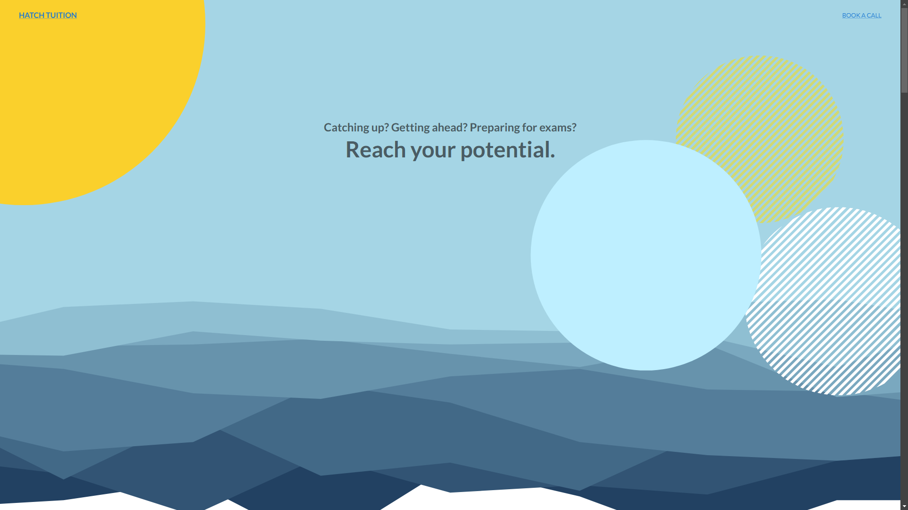
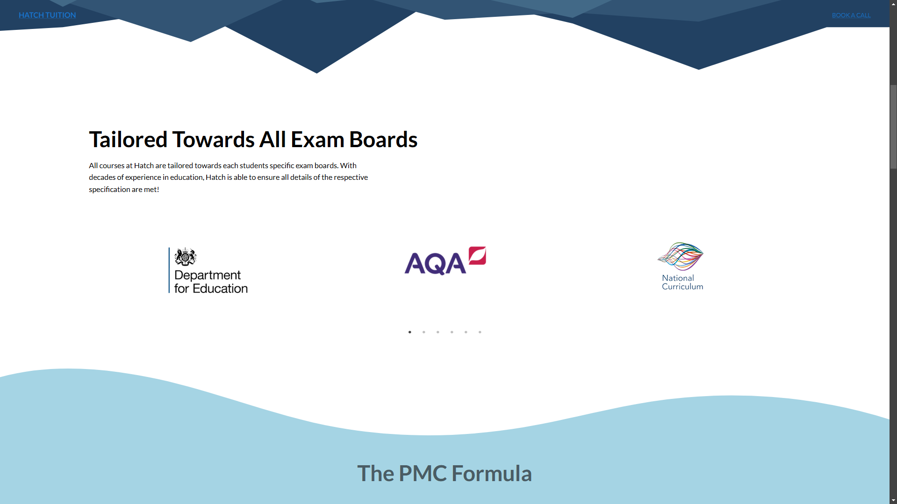
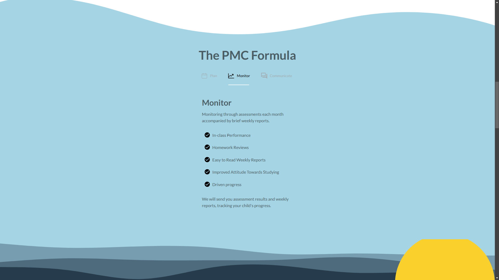
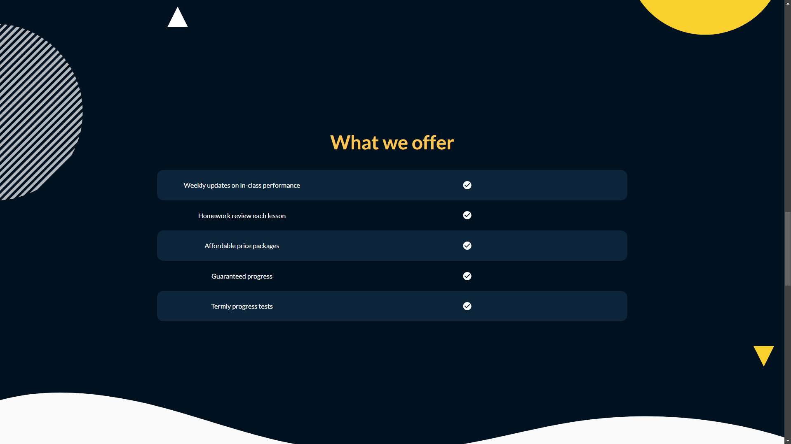
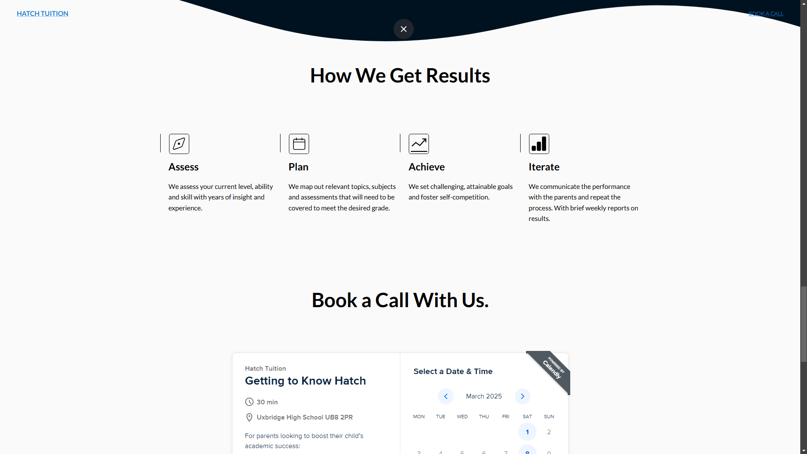
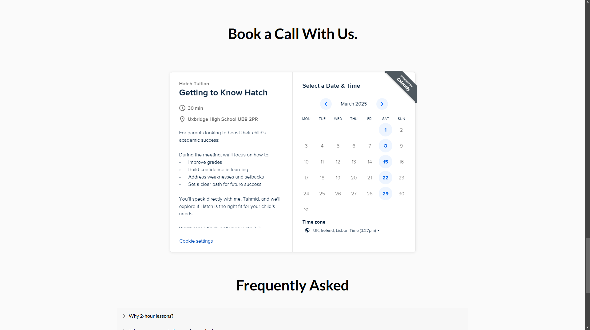
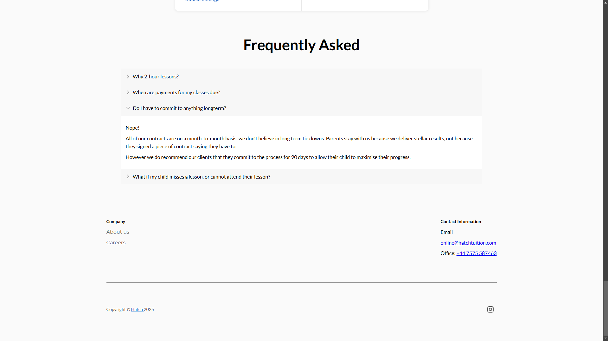
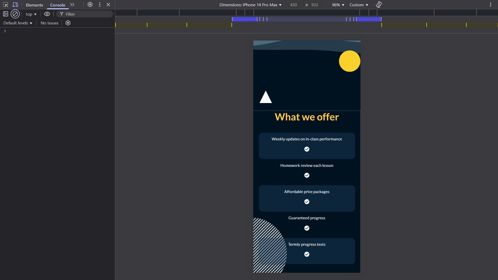
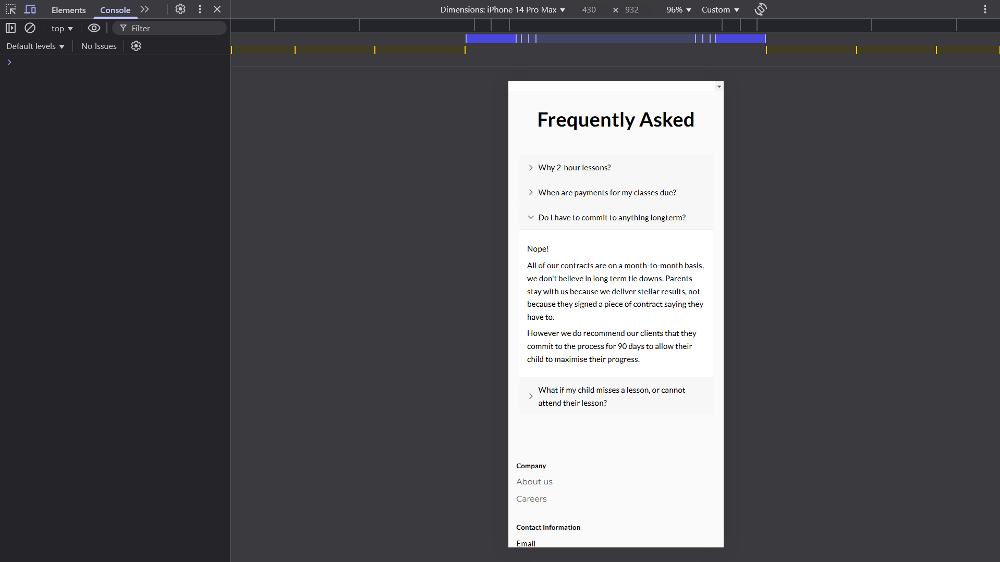

# Hatch Tuition Next.js Webpage

[](https://github.com/tahmidachoudhury/hatch-tuition)

---

## Table of Contents

- [Overview](#overview)
- [Features](#features)
- [Screenshots](#screenshots)
- [Contact](#contact)

---

## Overview

My first Next.js project, deployed via Netflify. Leveraged Nextjs's SEO optimization and unique capabilities. I chose Material-ui as the frontend library due to the variety of components available and the large developer community.

---

## Features

- **Feature 1:** Material UI components

- **Feature 2:** Nextjs SEO Features implemented

---

## Installation

Follow these steps to get your development environment set up:

1. **Clone the repository:**
   ```bash
   git clone https://github.com/tahmidachoudhury/hatch-tuition
   cd hatch-tuition
   ```

---

## Screenshots

Below are some screenshots that provide a visual overview of the project:

### Main Interface








_Here is the main page for the site. It is a basic static page, providing parents with a brief overview of our services. The content of the site needs to be improved, however this was my first version of the site._

### Feature 1: Material UI Components


_After completing a course on React, I stopped building components myself and switched to a UI library. I chose Material-UI however looking back, Tailwind would have been a better option as there is a lot of flexibility and customisation available._

---

_Including plugins such as Daisy ui and component libraries such as Shad-cn, that are compatible with Tailwind CSS._

### Feature 2: Next.js SEO features




_Instead of keeping all buttons the same colour, I found other apps dynamically changing colour when interacted with. After implementing, it really improved the feel of the calculator and made it a lot easier on the eyes._

---

## Contact

If you have any questions, suggestions, or feedback, feel free to reach out!

- **Email:** [tahmidachoudhury@outlook.com](mailto:tahmidachoudhury@outlook.com)
- **LinkedIn:** [Tahmid Choudhury](https://www.linkedin.com/in/tahmid-choudhury-a1a05a252)
